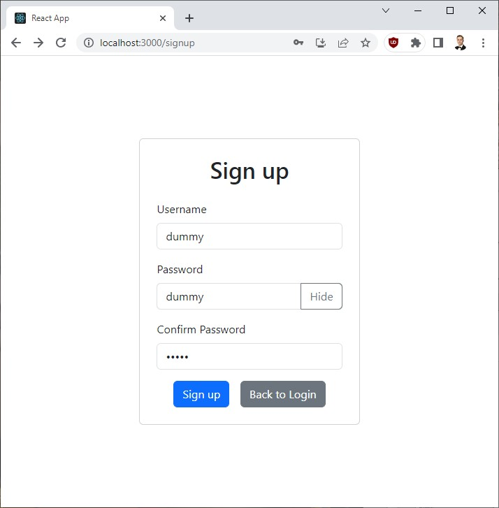
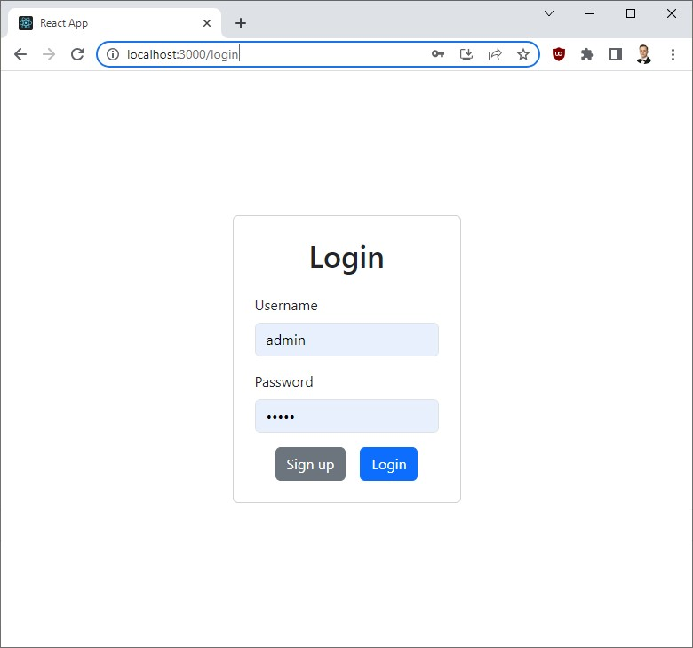
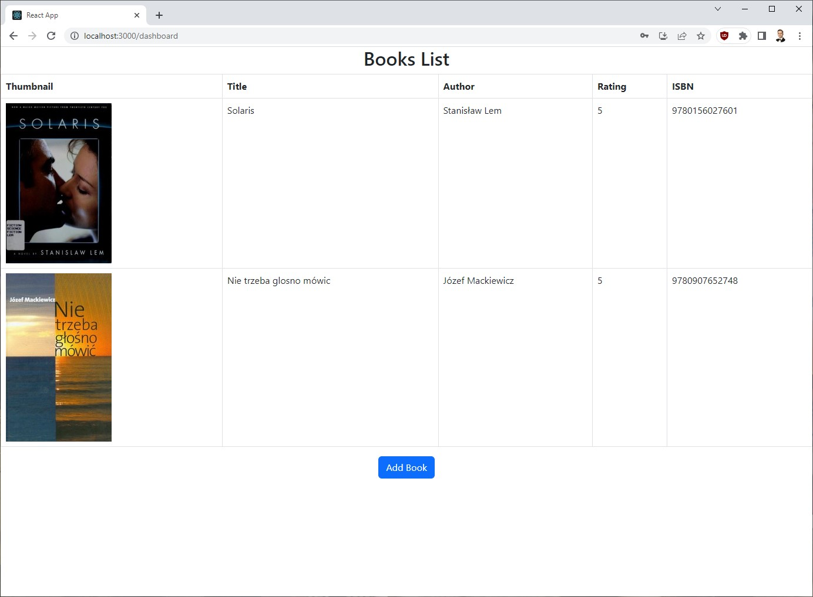
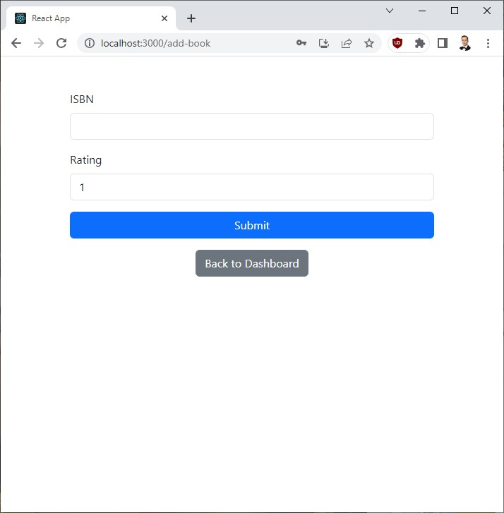

# Bookshelf

## About

Bookshelft is a full-stack web development project aimed at improving skills in web development, specifically using the FastAPI framework for the backend and React for the frontend. The project revolves around building a simple bookshelf application where users can register, log in, and add books to their personal book collection.

Key Features:

* User Registration and Login: Users can create an account by registering with a unique username and password. They can then log in securely using their credentials.
* Authentication and Authorization: Bookshelft implements JWT-based authentication to ensure secure communication between the frontend and backend. Only authenticated users can access certain endpoints, ensuring data privacy.
* Book Management: Authenticated users can add books to their personal collection. Each book is associated with an International Standard Book Number (ISBN) and a user-provided rating (ranging from 1 to 5).
* Open Library Integration: The application leverages the Open Library API to fetch additional book details, such as the book's title, author, and cover thumbnail, based on the provided ISBN.
* Responsive Design: The frontend is designed to be responsive and visually appealing across various devices, ensuring a seamless user experience on both desktop and mobile.

The Bookshelft project serves as an excellent learning opportunity for developers looking to enhance their proficiency in modern web development technologies. It incorporates essential concepts like RESTful API design, database interactions using SQLAlchemy, state management in React, and frontend styling using Bootstrap.

The combination of FastAPI and React offers a robust and efficient full-stack development environment, allowing developers to create dynamic web applications with a focus on security and user experience.

Overall, Bookshelft provides an ideal platform for web developers to sharpen their skills, explore the integration of popular frameworks, and gain hands-on experience in building real-world applications.

## Screnshots

### Signup

### Login

### Dashboard view

### Adding a new book

## Development plan

* Navigation bar at the top of the view.
* Logout button
* Search option in add-book view, searching based on title or author instead of only ISBN
* Modify rating on dashboard
* Divide dashboard into 2 tabs: my books and household books
* Docker image to run on RPi in local home network
